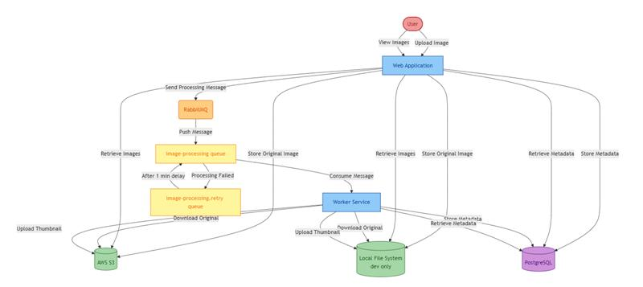

# DevDay Workshop: Modernize Legacy Java Applications with GitHub Copilot for Modernization

This hands-on workshop is designed to introduce EDU audiences to a practical, AI-assisted approach for modernizing a Java 8 application. Using the **Asset Manager** sample app and [GitHub Copilot for modernization](https://marketplace.visualstudio.com/items?itemName=vscjava.migrate-java-to-azure), attendees will explore how state-of-the-art developer tools can further accelerate common modernization tasks without requiring deep prior experience in cloud migration and modernization.


## Objectives
By the end of this workshop, attendees will be able to:

- Run an AI-assisted assessment on a legacy Java application
- Identify modernization issues and recommended next steps
- Generate containerization artifacts for an existing monolithic application
- Use AI to help create infrastructure specs to prepare for deployment to cloud
- Use GitHub Copilot for debugging and understand how AI can reduce the barrier to entry for modernization


## Prerequisites
- A GitHub account with [GitHub Copilot](https://github.com/features/copilot) enabled.
- One of the following IDEs:
  - The latest version of [Visual Studio Code](https://code.visualstudio.com/). Must be version 1.101 or later.
    - [GitHub Copilot in Visual Studio Code](https://code.visualstudio.com/docs/copilot/overview). For setup instructions, see [Set up GitHub Copilot in Visual Studio Code](https://code.visualstudio.com/docs/copilot/setup). Be sure to sign in to your GitHub account within Visual Studio Code.
    - [GitHub Copilot for modernization](https://marketplace.visualstudio.com/items?itemName=vscjava.migrate-java-to-azure). Restart Visual Studio Code after installation.
  - The latest version of [IntelliJ IDEA](https://www.jetbrains.com/idea/download). Must be version 2023.3 or later.
    - [GitHub Copilot](https://plugins.jetbrains.com/plugin/17718-github-copilot). Must be version 1.5.59 or later. For more instructions, see [Set up GitHub Copilot in IntelliJ IDEA](https://docs.github.com/en/copilot/get-started/quickstart). Be sure to sign in to your GitHub account within IntelliJ IDEA.
    - [GitHub Copilot for Modernization Extension](https://plugins.jetbrains.com/plugin/28791-github-copilot-app-modernization). Restart IntelliJ IDEA after installation. If you don't have GitHub Copilot installed, you can install GitHub Copilot app modernization directly.
    - For more efficient use of Copilot in app modernization: in the IntelliJ IDEA settings, select the **Tools** > **GitHub Copilot** configuration window, and then select **Auto-approve** and **Trust MCP Tool Annotations**. For more information, see [Configure settings for GitHub Copilot app modernization to optimize the experience for IntelliJ](configure-settings-intellij.md).
- [Java JDK](/java/openjdk/download) for source and target JDK versions, i.e. [JDK 8](https://learn.microsoft.com/en-us/java/openjdk/download#openjdk-8) and Java 21.
- [Maven 3.6.0+](https://maven.apache.org/install.html) or [Gradle](https://gradle.org/install/) to build Java projects.
- [Docker Desktop](https://docs.docker.com/desktop/) (for PostgreSQL and RabbitMQ containers)
- In the Visual Studio Code settings, make sure `chat.extensionTools.enabled` is set to `true`. This setting might be controlled by your organization if using GitHub Copilot Business or GitHub Copilot Enterprise.

Optional:
- [Node.js 18+](https://nodejs.org/) and npm
- [Angular CLI](https://angular.dev/tools/cli): `npm install -g @angular/cli`


## Sample application
The [Asset Manager](https://github.com/Azure-Samples/java-migration-copilot-samples/tree/main/asset-manager) app is consisted of 2 modules, `Web` and `Worker` with functions for the following components:
* PostgreSQL database for metadata storage, using password-based authentication
* RabbitMQ for queuing messages, using password-based authentication
* AWS S3 for image storage, using password-based authentication (access key/secret key)


Current architecture:




Target state:


## Running locally
To run the asset-manager app locally:

Windows:
```
scripts\startapp.cmd
```

Linux/Unix:
```
scripts/startapp.sh
```

This will launch PostgreSQL and RabbitMQ via Docker and starts both the web and worker modules with the `dev` profile (local file storage instead of S3). Open http://localhost:8080 to verify the Thymeleaf UI loads.


## Clean up

When no longer needed, you can delete all related Azure resources using the following scripts.

Windows:
```bash
scripts\cleanup-azure-resources.cmd -ResourceGroupName <your resource group name>
```

Linux/Unix:
```bash
scripts/cleanup-azure-resources.sh -ResourceGroupName <your resource group name>
```

If you deploy the app using GitHub Codespaces, delete the Codespaces environment by navigating to your forked repository in GitHub and selecting **Code** > **Codespaces** > **Delete**.
