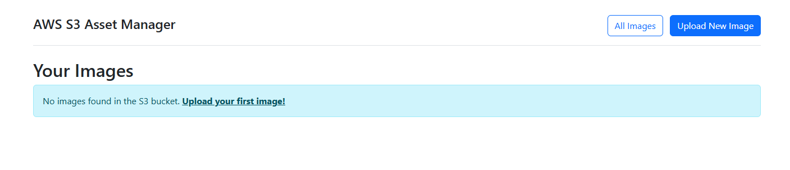
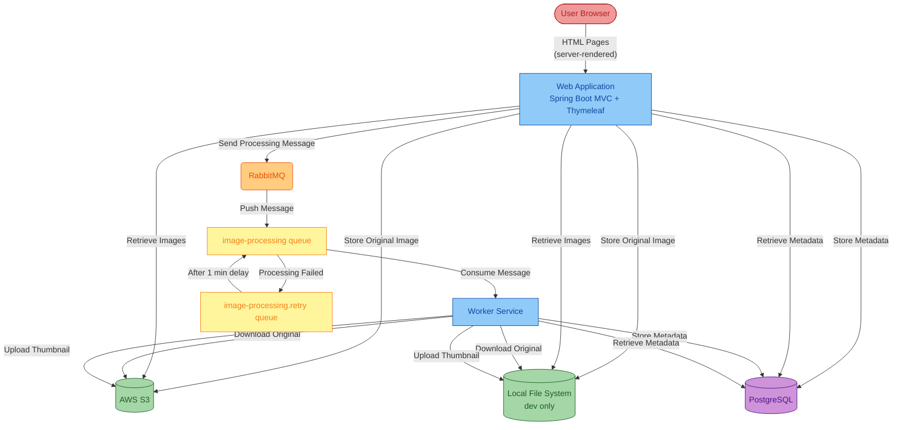
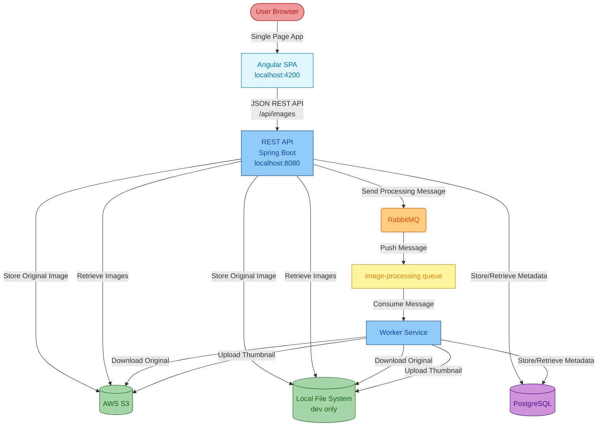

# DevDay Workshop: Modernize Legacy Java Applications with GitHub Copilot for Modernization

This hands-on workshop is designed to introduce EDU audiences to a practical, AI-assisted approach for modernizing a Java 8 application. Using the **Asset Manager** sample app and [GitHub Copilot for modernization](https://marketplace.visualstudio.com/items?itemName=vscjava.migrate-java-to-azure), attendees will explore how state-of-the-art developer tools can further accelerate common modernization tasks without requiring deep prior experience in cloud migration and modernization.


## Objectives
By the end of this workshop, attendees will be able to:

- Run an AI-assisted assessment on a legacy Java application
- Identify modernization issues and recommended next steps
- Generate containerization artifacts for an existing monolithic application
- Use AI to help create infrastructure specs to prepare for deployment to cloud
- Use GitHub Copilot for debugging and understand how AI can reduce the barrier to entry for modernization


## Prerequisites
- [Java JDK](https://learn.microsoft.com/en-us/java/openjdk/download) for source and target JDK versions, i.e. [JDK 8](https://learn.microsoft.com/en-us/java/openjdk/download#openjdk-8) and [JDK 21](https://learn.microsoft.com/en-us/java/openjdk/older-releases#openjdk-21).
- [Maven 3.6.0+](https://maven.apache.org/install.html) or [Gradle](https://gradle.org/install/) to build Java projects.
- [Docker Desktop](https://docs.docker.com/desktop/) (for PostgreSQL and RabbitMQ containers)
- [Git](https://git-scm.com/install/)

Optional:
- [Node.js 18+](https://nodejs.org/) and npm
- [Angular CLI](https://angular.dev/tools/cli): `npm install -g @angular/cli`


## Getting started

- Clone or fork this repository or click on `Fork` to fork this repo from GitHub.

```text
git clone https://github.com/cindyw4/modernization-workshop.git
```


- Start your IDE and navigate to the project folder to access source code.


- Navigate to the `workshop` folder in the [main](https://github.com/cindyw4/modernization-workshop/tree/main/workshop) branch


- Run the sample `asset-manager` application locally:

Windows:
```
scripts\startapp.cmd
```

Linux/Unix:
```
scripts/startapp.sh
```


This will launch PostgreSQL and RabbitMQ via Docker and starts both the web and worker modules with the `dev` profile (local file storage instead of S3). Open http://localhost:8080 to verify the Thymeleaf UI loads.





## Sample application
The [Asset Manager](https://github.com/Azure-Samples/java-migration-copilot-samples/tree/main/asset-manager) app is consisted of 2 modules, `Web` and `Worker` with functions for the following components:
* PostgreSQL database for metadata storage, using password-based authentication
* RabbitMQ for queuing messages, using password-based authentication
* AWS S3 for image storage, using password-based authentication (access key/secret key)


Current architecture:



Target state:


