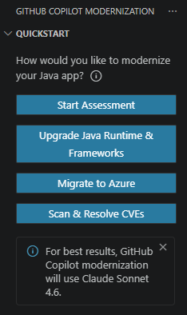
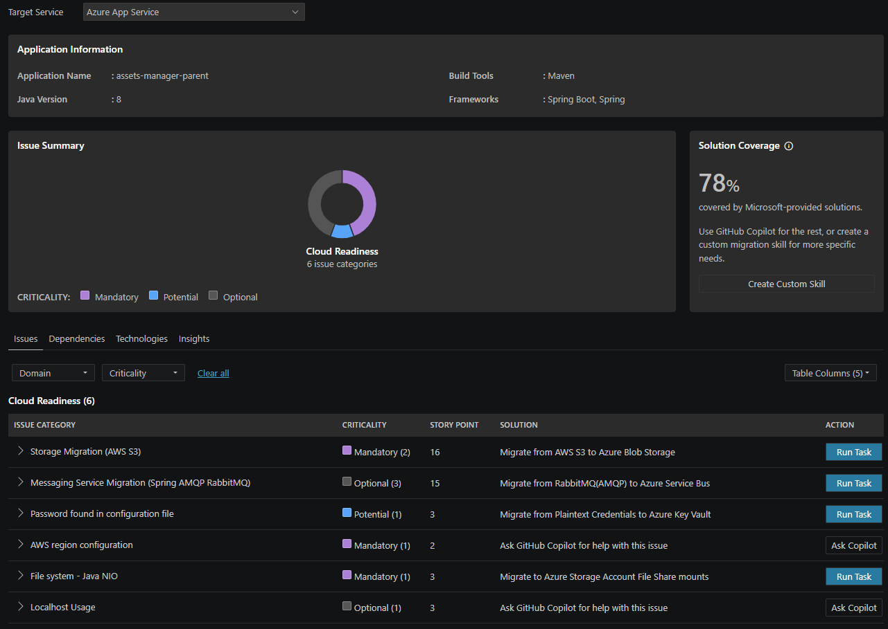

# Module 1: Assessment & Strategy

In this module, you will be learning to use GitHub Copilot to conduct an AI-assisted assessment of the `asset-manager` app. 

### Install the modernization extension
In VS Code, open the Extensions view from the Activity Bar, search for the GitHub Copilot modernization extension in the marketplace. Click on the Install button. After installation completes, you should see a notification in the bottom-right corner of VSCode confirming success.

Alternative: IntelliJ IDEA Alternatively, you can use IntelliJ IDEA. Open File > Settings (or IntelliJ IDEA > Preferences on macOS), navigate to Plugins > Marketplace, search for GitHub Copilot modernization, and click Install. Restart IntelliJ IDEA if prompted.

### Assess your Java application
An assessment provides insights into the application's readiness for cloud.

1. Open VS Code with all the prerequisites installed for the asset manager by changing to the `asset-manager` directory.

2. Open the GitHub Copilot modernization extension from left sidebar.

3. In the QUICKSTART view, click on Start Assessment to create a `Recommended Assessment` and select `Cloud Readiness` as assessment categories.

4. Wait for the assessment to be completed and a report to be generated.

5. Review your `Assessment Report`. Click on the Issues tab and expand on `ISSUE CATEGORY` to review proposed solutions for issues identified in this report.

### Discussion
Based on your findings from your  `Assessment Report`:
- If we handed this codebase to a new hire today, what is the first thing they would struggle to understand?
- Which component would you modernize first and why?
- What secuirty or compliance risks do you see about keeping this application on Java 8 for another 3 years?