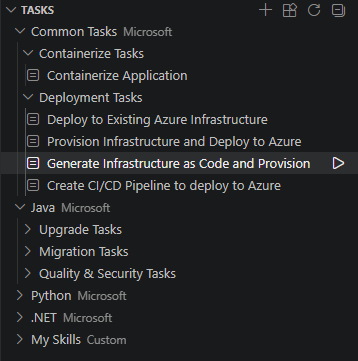
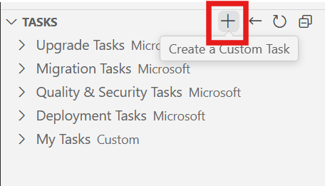

# Module 3: Replatform with Infrastructure as Code (IaC)
In this module, you will be learning to use tasks or custom skills to generate Bicep or Terraform scripts to deploy to a cloud service (PaaS) of your choice.

> Note: Tasks are not supported for the IntelliJ IDEA plugin. If you are using IntelliJ IDEA, you can skip this section and proceed to the next section.


## Tasks & Custom Skills
1. Open GitHub Copilot modernization extension from left sidebar and go to `Deployment Tasks` by expanding on `Common Tasks`.



### Alternative
Create a Custom Skill by clicking on the `+` sign in the Tasks view to create a custom skill to create IaC scripts.



2. Click on `Generate Infrastructure as Code and Provision`.

3. Click on the generated plan file (`plan.copilotmd`) and review AI-generated Bicep/Terraform scripts.

4. Optional: modify your IaC scripts as needed and provision resources in Azure. After deploying to the cloud, verify that your application is accessible and functional in your chosen cloud hosting service.


## Build a new Angular frontend
### Scaffold the Angular project

1. **Generate the project** (from the repo root):
    ```bash
    ng new frontend --routing --style=scss
    cd frontend
    ```

2. **Configure the dev proxy** — create `frontend/proxy.conf.json`:
    ```json
    {
      "/api": {
        "target": "http://localhost:8080",
        "secure": false
      }
    }
    ```

3. **Start the dev server** with proxy:
    ```bash
    ng serve --proxy-config proxy.conf.json
    ```
    The Angular app runs on http://localhost:4200 and proxies `/api/**` requests to the Spring Boot backend.

### Build core components in Angular

Build the following core components:

1. **`ImageService`** (`frontend/src/app/services/image.service.ts`):
    ```typescript
    @Injectable({ providedIn: 'root' })
    export class ImageService {
      private apiUrl = '/api/images';

      constructor(private http: HttpClient) {}

      getImages(): Observable<ImageResponse[]> {
        return this.http.get<ImageResponse[]>(this.apiUrl);
      }

      uploadImage(file: File): Observable<ImageResponse> {
        const formData = new FormData();
        formData.append('file', file);
        return this.http.post<ImageResponse>(this.apiUrl, formData);
      }

      deleteImage(key: string): Observable<void> {
        return this.http.delete<void>(`${this.apiUrl}/${key}`);
      }
    }
    ```

2. **`ImageListComponent`** — Card grid displaying images with thumbnails:
    - Replaces `list.html` Thymeleaf template
    - Uses RxJS `interval` + `switchMap` instead of vanilla JS polling
    - Angular Material cards or Bootstrap grid layout

3. **`ImageUploadComponent`** — Drag-and-drop file upload:
    - Replaces `upload.html` Thymeleaf template
    - Uses `HttpClient` with `reportProgress: true` for upload progress bar
    - Angular reactive form with file input + drag-drop zone

4. **`ImageViewComponent`** — Full image viewer with metadata:
    - Replaces `view.html` Thymeleaf template
    - Route parameter: `/images/:key`
    - Displays image, size, timestamps, download button

5. **Routing** (`app-routing.module.ts`):
    ```typescript
    const routes: Routes = [
      { path: '', redirectTo: '/images', pathMatch: 'full' },
      { path: 'images', component: ImageListComponent },
      { path: 'images/upload', component: ImageUploadComponent },
      { path: 'images/:key', component: ImageViewComponent },
    ];
    ```

### Run with full stack
Validate that the full stack is functional by splitting to 2 terminals:

| Terminal | Command | URL |
|----------|---------|-----|
| Terminal 1 | `scripts\startapp.cmd` | http://localhost:8080 (backend + legacy UI) |
| Terminal 2 | `cd frontend && ng serve --proxy-config proxy.conf.json` | http://localhost:4200 (Angular SPA) |


1. Start the Angular UI at http://localhost:4200
2. Upload an image through the Angular upload component
3. Watch the image list auto-refresh as the worker generates a thumbnail
4. Click an image to view full details
5. Delete an image and confirm removal
6. Compare side-by-side with the legacy Thymeleaf UI at http://localhost:8080

---

### Alternative
Create a Custom Skill by clicking on the `+` sign in the Tasks view to create a custom skill for Angular.


## Clean up

When no longer needed, you can delete all related Azure resources using the following scripts.

Windows:
```bash
scripts\cleanup-azure-resources.cmd -ResourceGroupName <your resource group name>
```

Linux/Unix:
```bash
scripts/cleanup-azure-resources.sh -ResourceGroupName <your resource group name>
```

If you deploy the app using GitHub Codespaces, delete the Codespaces environment by navigating to your forked repository in GitHub and selecting **Code** > **Codespaces** > **Delete**.